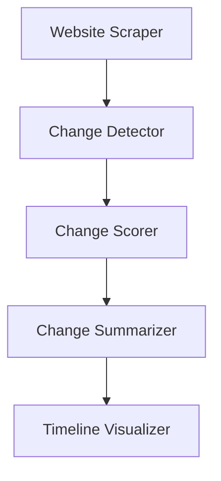
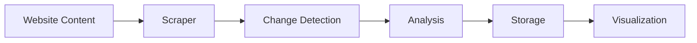

# Architecture Overview

## System Architecture

The Website Tracker platform is built with a modular architecture focusing on scalability, maintainability, and extensibility. This document outlines the key components and their interactions.

## Core Components

### 1. Change Detection System

#### Components:
- **Website Scraper**: Fetches website content using Selenium
- **Change Detector**: Identifies content modifications
- **Change Scorer**: Evaluates change significance
- **Change Summarizer**: Generates AI-powered analysis
- **Timeline Visualizer**: Displays changes chronologically

### 2. Frontend Interface

The user interface is built using Streamlit, providing:
- Interactive monitoring dashboard
- Configuration management
- Visual change comparison
- Timeline visualization

### 3. Data Flow

## Technical Stack

### Core Technologies
- Python 3.11
- Streamlit
- OpenAI API
- Selenium WebDriver
- SQLite/PostgreSQL

### Key Libraries
- `diff-match-patch`: Text comparison
- `Pillow`: Image processing
- `pandas`: Data manipulation
- `mkdocs`: Documentation

## Implementation Details

### 1. Change Detection
- Uses diff algorithms for text comparison
- Implements visual diff highlighting
- Maintains change history

### 2. AI Integration
- OpenAI API for change analysis
- Automated significance scoring
- Natural language summaries

### 3. Data Management
- JSON-based configuration
- Efficient storage strategies
- Cache management

## Security Considerations

### API Security
- Environment-based secret management
- Rate limiting implementation
- Secure API communication

### Data Protection
- Encrypted storage
- Access control
- Audit logging

## Performance Optimization

### Caching Strategy
- Content caching
- Analysis results caching
- Image caching

### Resource Management
- Concurrent processing
- Batch operations
- Memory optimization

## Testing Strategy

### Test Types
1. Unit Tests
   - Component-level testing
   - Mock integration points

2. Integration Tests
   - Cross-component functionality
   - API integration

3. Performance Tests
   - Load testing
   - Response time verification

## Deployment

### Requirements
- Python 3.11+
- Required system dependencies
- Environment configuration

### Configuration
- Environment variables
- API keys
- Monitoring settings

## Future Considerations

### Scalability
- Distributed processing
- Load balancing
- Horizontal scaling

### Extensibility
- Plugin architecture
- Custom analyzers
- API extensions

For implementation details, refer to the [API Documentation](../api/index.md).
